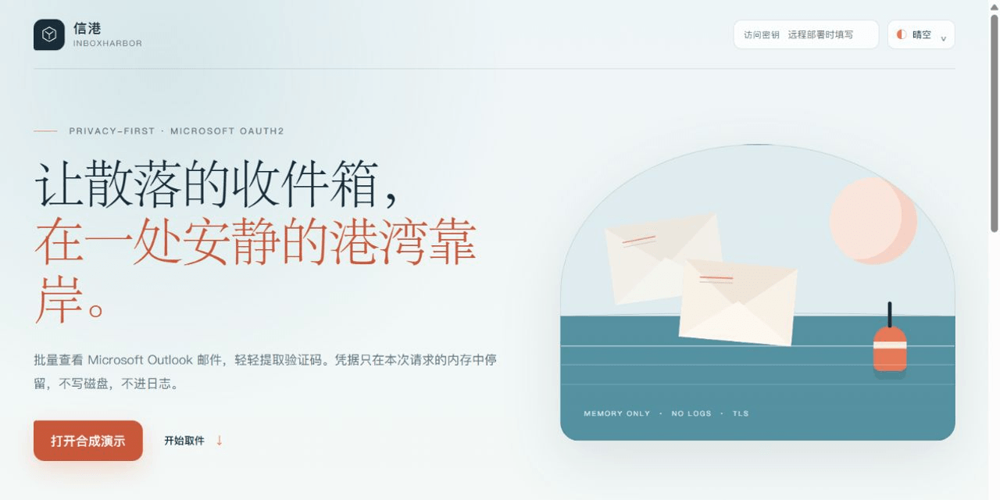
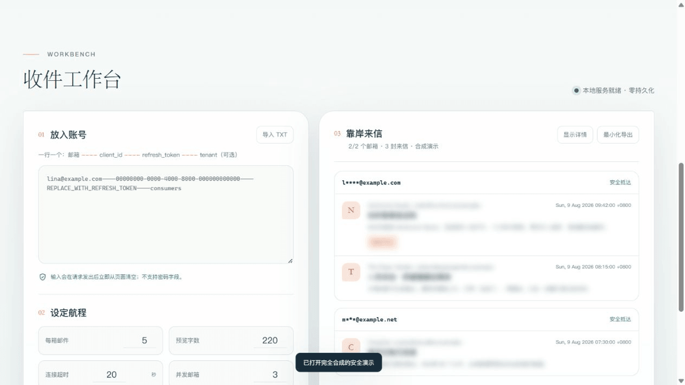

# InboxHarbor · 信港

[](https://github.com/ferretgeek/InboxHarbor/actions/workflows/ci.yml)
[](https://github.com/ferretgeek/InboxHarbor/actions/workflows/codeql.yml)
[](https://www.python.org/)
[](requirements.txt)
[](LICENSE)

> A quiet harbor for inboxes that usually arrive scattered.

InboxHarbor is a batch inbox workbench for Microsoft Outlook and Microsoft 365. It reads recent messages over OAuth2, surfaces verification codes, and keeps real accounts and message details behind a privacy veil by default.

[中文](README.md) · [Deployment](docs/DEPLOYMENT.md) · [Security model](docs/SECURITY_MODEL.md) · [Release audit](docs/发布审计.md) · [Issues](https://github.com/ferretgeek/InboxHarbor/issues)

## At a glance

- **Batch arrival** — read up to 50 mailboxes per run with bounded concurrency.
- **Modern authentication** — Microsoft OAuth2/XOAUTH2 only; mailbox passwords are rejected.
- **Memory-only credentials** — account records and tokens are never written or logged.
- **Deliberately narrow reads** — fixed Microsoft hosts, read-only inbox access, and strict count, size, timeout, and rate limits.
- **Private by default** — masked accounts, veiled message details, and minimal exports with no sender, subject, body, or code value.
- **A considered interface** — Sky, Jade, and Sunset light themes plus a deep-gray Graphite theme, all responsive.
- **Local and server ready** — one-command local use; loopback plus SSH tunneling is recommended for remote hosts, with protected HTTPS reverse proxy support when needed.



## Run locally

Python 3.10 or newer is required. There are no third-party runtime dependencies.

```powershell
python -m inbox_harbor
```

Open `http://127.0.0.1:4174`. “Open synthetic demo” is safe to explore and never connects to a mailbox.

Each account occupies one line:

```text
lina@example.com----12345678-1234-4234-9234-1234567890ab----REPLACE_WITH_REFRESH_TOKEN----consumers
```

The fields are email, Microsoft Entra application `client_id`, `refresh_token`, and optional `tenant`. Passwords are not accepted. Read [authentication setup](docs/AUTHENTICATION.md) before acquiring OAuth credentials.

## Privacy boundary

InboxHarbor does not persist email addresses, client IDs, refresh/access tokens, message bodies, or verification codes. HTTP request logs are disabled and upstream Microsoft response bodies are never reflected in errors. The selected theme is the only value stored in `localStorage`.

It cannot protect data from a compromised extension, browser, operating system, reverse proxy, or Microsoft tenant. Remote traffic requires HTTPS; the safest server pattern is a loopback listener reached through an SSH tunnel. See the [security model](docs/SECURITY_MODEL.md).

## Microsoft references

- [POP, IMAP, and SMTP settings for Outlook.com](https://support.microsoft.com/en-us/outlook/pop-imap-and-smtp-settings-for-outlook-com)
- [Authenticate IMAP, POP, or SMTP using OAuth](https://learn.microsoft.com/en-us/exchange/client-developer/legacy-protocols/how-to-authenticate-an-imap-pop-smtp-application-by-using-oauth)
- [Microsoft identity platform OAuth 2.0](https://learn.microsoft.com/en-us/entra/identity-platform/v2-oauth2-auth-code-flow)

InboxHarbor is not affiliated with or endorsed by Microsoft.

## Verification

```powershell
python -m unittest discover -s tests -p "test_*.py" -v
node --test tests/core.test.js
ruff check inbox_harbor tests
bandit -q -lll -r inbox_harbor
python -m pip_audit -r requirements.txt
```

Releases also require Gitleaks and detect-secrets scans, full-history inspection, image/OCR/metadata review, a Docker build, and verification from a fresh public clone.

## License

[MIT](LICENSE) © 2026 ferretgeek
